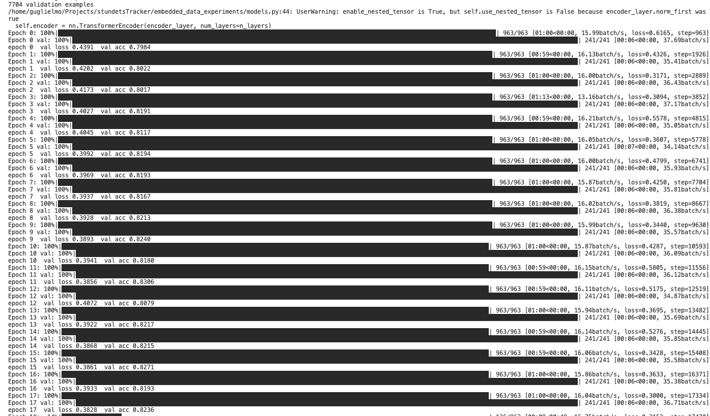

# Knowledge Tracing with Vision-Language Models

This repository presents two experiments for building and testing **Knowledge Tracing (KT)** models — systems that predict whether a student will answer the next exercise correctly, given their history of past attempts. Both experiments are trained and evaluated on the **MIAAM dataset**, comprising 38,519 students with an average of 168 exercises each.

---

## Experiment 1 — Raw Data (`raw_data_experiments/`)

A small Vision-Language Model (VLM) receives **raw multimodal input**: text descriptions of exercises and student attempts, plus screenshots of the exercises. No hand-crafted features are used. Two training regimes are available:

- **Probe** — the VLM backbone is frozen; only a final classification head is trained.
- **LoRA fine-tuning** — lightweight LoRA adapters are injected into the backbone and trained end-to-end.

The base model is [SmolVLM-256M-Instruct](https://huggingface.co/HuggingFaceTB/SmolVLM-256M-Instruct).

**Key limitation:** the small context window of the VLM allows only 4–5 past attempts to be included in each input sequence. Given that students in the dataset average 168 exercises, the vast majority of each student's history is discarded at every training step.

See [raw_data_experiments/README.md](raw_data_experiments/README.md) for full details and setup instructions.

---

## Experiment 2 — Embedded Data (`embedded_data_experiments/`)

Instead of passing raw content to the model at training time, each exercise and each student attempt is **pre-encoded once** into a fixed-size embedding vector using a frozen VLM. A lightweight Transformer then learns to reason over sequences of these vectors to predict the outcome of the next attempt.

The input sequence for a student who has completed `t` exercises is:

```
[ emb(ex_0), emb(att_0), emb(ex_1), emb(att_1), ..., emb(ex_{t-1}), emb(att_{t-1}), emb(ex_t) ]
```

**Key advantage over Experiment 1:** because embeddings are pre-computed and compact, the Transformer can accept histories of up to **512 past exercises** — covering most students in full rather than truncating their history.

### Results

The figure below shows a short training session. The model reaches ~83% validation accuracy, which is a promising result given that it was obtained with a very small VLM for encoding and no hyperparameter tuning.



See [embedded_data_experiments/README.md](embedded_data_experiments/README.md) for full details and setup instructions.

---

## Setup

Both experiments share a single virtual environment at the repository root:

```bash
python -m venv .venv
source .venv/bin/activate
pip install -r requirements.txt
```

Then follow the setup instructions in the README of whichever experiment you want to run.
